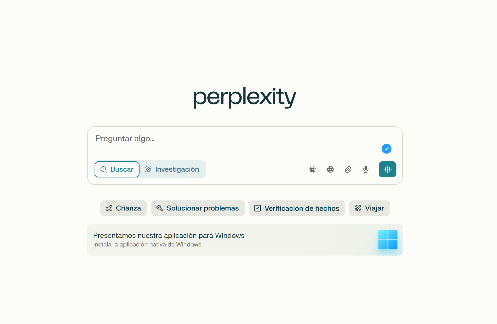
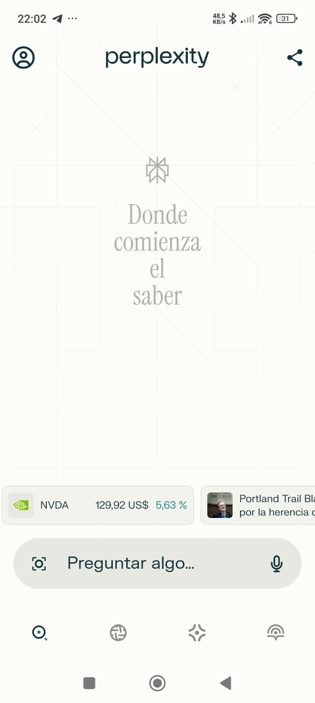

# PEC3: Visionando el futuro con las gafas de Manovich

**Recurso de aprendizaje de Cultura Digital**  
**Autor:** Javier Aliaga Rodríguez  
**Fecha:** 13/05/2025  

---

## Planteamiento

Este ensayo explora el fenómeno de la hibridación mediática desde la perspectiva de Lev Manovich, seleccionando dos casos actuales que no han sido analizados por el autor: **Perplexity AI** y **Blob Opera**. Ambos reflejan cómo el software permite fundir medios, lenguajes y formas de interacción, generando nuevas formas culturales.

---

## Caso 1 – Perplexity AI: del buscador al diálogo cognitivo

Perplexity AI es más que un buscador o un chatbot. Es un entorno híbrido que transforma la manera en que accedemos y construimos conocimiento. Mediante una interfaz limpia y basada en lenguaje natural, responde consultas con información clara y bien referenciada, enlazando fuentes y manteniendo el contexto del diálogo.

  

### Identificación de principios del software en Perplexity AI

- **Modularidad:** Combina módulos de búsqueda, IA generativa y exploración temática.
- **Variabilidad:** Las respuestas cambian en función del usuario, contexto y consulta.
- **Automatización:** La IA genera texto relevante de forma automática y contextualizada.
- **Transcodificación:** Reconvierte el formato tradicional del buscador en una conversación estructurada y visualmente integrada.

### Conclusión parcial

Este tipo de interfaz no existía antes de la inteligencia artificial conversacional. Perplexity transforma la búsqueda de información en una experiencia **dialogada, ramificada y contextualizada**, propia de los nuevos medios descritos por Manovich. Ya no solo accedemos a datos: **participamos activamente en la construcción del conocimiento**.

---

## Caso 2 – Blob Opera: composición musical lúdica y algorítmica

Blob Opera, creado por David Li en colaboración con Google Arts & Culture, permite generar música coral manipulando criaturas animadas que cantan en armonía gracias al aprendizaje automático. El usuario, sin conocimientos musicales, puede componer en tiempo real simplemente arrastrando blobs animados en pantalla, en una experiencia que invita a explorar sin barreras técnicas.

  

### Identificación de principios del software en Blob Opera

- **Modularidad:** Cada blob representa una voz coral con sus propias características armónicas.
- **Variabilidad:** La música generada varía según las decisiones del usuario en tiempo real.
- **Automatización:** El sistema mantiene la armonía sin intervención técnica directa.
- **Transcodificación:** Transforma las reglas del canto coral en una experiencia manipulable visual y lúdicamente.

### Conclusión parcial

Blob Opera no es solo un experimento ni una app musical: **es un nuevo medio interactivo nacido del software**. Fusiona animación, música, IA y juego en una propuesta expresiva accesible, alineada con la idea de Manovich sobre la capacidad del software para crear nuevos lenguajes culturales.

---

## Conclusión general

Tanto Perplexity AI como Blob Opera ilustran la **hibridación mediática** tal como la define Manovich: la fusión de medios preexistentes en nuevas formas de interacción, representación y experiencia. Ya no hablamos de buscadores, juegos o instrumentos musicales, sino de **interfaces culturales híbridas** donde el software actúa como metamedio y generador de significado.

> “La interfaz se ha convertido en un nuevo lenguaje cultural” (Manovich, 2013).  
> Ambos casos demuestran que lo esencial no es lo digital en sí, sino cómo el software **reorganiza y transforma lo expresivo y lo funcional**.

Ambos casos nos recuerdan que lo digital cobra sentido cuando genera experiencias culturales vivas, abiertas y significativas.

---

## Referencias y Bibliografía

- Adell Español, F. (2024). *Fundamentos y evolución de la multimedia*. Barcelona: Editorial UOC.
- Manovich, L. (2013). *El software toma el mando*. Barcelona: Editorial UOC.
- Manovich, L. *Understanding Hybrid Media*. http://manovich.net
- Google Arts & Culture – Blob Opera: https://artsandculture.google.com/experiment/blob-opera/AAHWrq360NcGbw
- Perplexity AI: https://www.perplexity.ai/

**Licencia:** Contenido desarrollado bajo licencia **CC BY-SA 4.0**.

---
